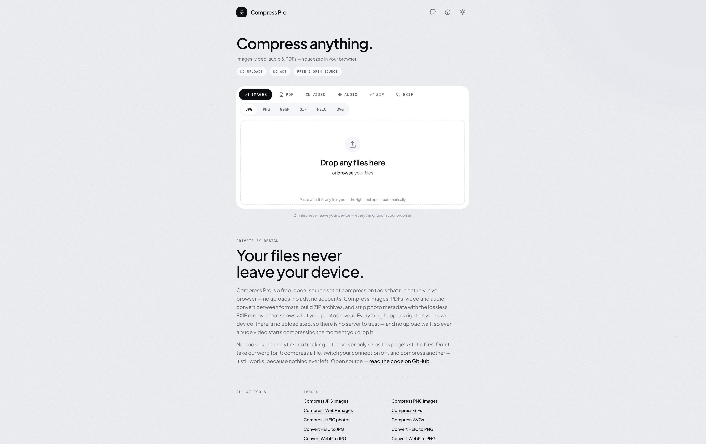

# Compress Pro | Private, In-Browser Image, Video, PDF & Audio Compressor


**Keywords:** `image compression` • `pdf compression` • `video compression` • `webp` • `avif` • `heic` • `remove exif` • `webassembly` • `webcodecs` • `client-side` • `private` • `no upload`

## 🔗 [Try it live → compress-pro.com](https://compress-pro.com)



> **Compress images, video, audio and PDFs — and strip EXIF — entirely in your browser.** No uploads, no ads, no login, nothing stored server-side. Free & open source — files never leave your machine.

## 👀 Overview

Compress Pro is a free, open-source, private-by-design file compressor. It shrinks **images, video, audio and PDFs** — zips and unzips archives, and strips **EXIF** metadata — running **entirely in the browser** via WebAssembly + WebCodecs.

The whole app is prerendered and served as static assets, so files never leave the machine. Compression runs in Web Workers, so the UI stays responsive. There are no ads, no login and nothing stored server-side — privacy is the product's core promise and its SEO angle. It deploys to **Cloudflare Workers** for ~$0/month.

## 🚀 Features

- **🖼️ Images** — JPG, PNG, WebP, GIF, HEIC, SVG. Squoosh codecs ([jSquash](https://github.com/jamsinclair/jSquash)): MozJPEG **with trellis quantization** (3–30% smaller at the same quality), libwebp (effort 6), libavif, oxipng; lossy PNG via libimagequant ([icodec](https://github.com/Kaciras/icodec), quality 100 stays lossless). Optional max-dimension downscale (Lanczos3) and **target-size** mode ("fit under 500 KB", binary search).
- **📄 PDF** — Ghostscript 10 in wasm ([`@okathira/ghostpdl-wasm`](https://github.com/okathira/ghostpdl-wasm)): explicit DPI + JPEG-quality control, bicubic downsampling, duplicate-image detection, font subsetting, metadata stripping. 5 preset levels or **target size** ("fit under 2 MB") via binary search over a quality ladder. Before/after page-1 comparison via pdf.js.
- **🎬 Video** — compress and convert MP4/MOV/WebM/MKV via **WebCodecs** (the browser's hardware encoders) orchestrated by [mediabunny](https://mediabunny.dev) — no ffmpeg, ~realtime encodes. H.264 (MP4), VP9 (WebM) or **animated GIF** output, quality or **target-size** mode, longest-side downscale, fps cap, remove-audio; audio otherwise transmuxes losslessly when container-legal. GIFs convert back to silent MP4/WebM too.
- **🎵 Audio** — compress and convert MP3/M4A/WAV/OGG — FLAC as input (LAME wasm for MP3), extract audio from video (MP4 → MP3), bitrate or target-size mode.
- **🔐 PDF unlock & protect** — remove a known password or add one (128-bit encryption) — the password never leaves the device.
- **📦 ZIP** — create archives from any files (deflate level knob) and extract existing ones, entirely client-side (fflate).
- **🧹 EXIF removal** — lossless byte surgery on JPG/PNG/WebP: EXIF/GPS, XMP, Photoshop blocks, comments and PNG text chunks are cut out with pixels copied verbatim; ICC profiles kept by default (toggle), orientation re-embedded so photos never turn sideways. Each result row discloses what was found.
- **✨ Auto format** (default) — on the JPG/PNG/WebP tabs the worker races MozJPEG vs WebP (and AVIF for images ≤4 MP under cross-origin isolation) per image and keeps the smallest file; animation stays WebP, transparency never falls to JPEG, and the untouched original wins when nothing beats it.
- **⚡ Parallel + threaded codecs** — batches fan out across a pool of image workers with per-row live status, and the app is **cross-origin isolated** (COOP/COEP), which activates the bundled multithreaded AVIF and oxipng builds.
- **📴 Offline PWA** — a service worker precaches the shell and prerendered pages and runtime-caches each codec wasm on first use, so the app keeps working offline — any tool used once compresses with no connection at all.
- **🧰 PDF tools** — merge PDFs (reorderable, optional compress-after-merge), extract/remove pages (`1-3,7,12-`), render pages to JPG/PNG (72/150/300 DPI, multi-page → ZIP), and build a PDF from images.
- **🗜️ Batch + ZIP** — multi-file batches keep input order; download everything as a ZIP (fflate, client-side).
- **📋 Clipboard & drag-drop** — paste files/screenshots anywhere (⌘V / Ctrl+V routes them to the right tab), drop files anywhere on the page, and copy compressed images back to the clipboard.

## 🧰 Tools & Converters

Every tool is its own real, prerendered page.

### Compress

| Tool                                                                     | Engine                 |
| ------------------------------------------------------------------------ | ---------------------- |
| [Compress JPG](https://compress-pro.com/compress-jpg)                    | MozJPEG + trellis      |
| [Compress PNG](https://compress-pro.com/compress-png)                    | oxipng / libimagequant |
| [Compress WebP](https://compress-pro.com/compress-webp)                  | libwebp                |
| [Compress GIF](https://compress-pro.com/compress-gif)                    | gifsicle               |
| [Compress HEIC](https://compress-pro.com/compress-heic)                  | libheif (icodec)       |
| [Compress SVG](https://compress-pro.com/compress-svg)                    | svgo                   |
| [Compress PDF](https://compress-pro.com/compress-pdf)                    | Ghostscript            |
| [Compress Video](https://compress-pro.com/compress-video)                | WebCodecs + mediabunny |
| [Compress MP4](https://compress-pro.com/compress-mp4)                    | WebCodecs + mediabunny |
| [Compress any image](https://compress-pro.com/compress-image)            | Auto format race       |
| [Compress JPG to 100 KB](https://compress-pro.com/compress-jpg-to-100kb) | target-size search     |
| [Compress Audio](https://compress-pro.com/compress-audio)                | mediabunny + LAME MP3  |
| [Zip & Unzip files](https://compress-pro.com/zip-files)                  | fflate                 |
| [Resize images](https://compress-pro.com/resize-image)                   | Lanczos3 downscale     |
| [Remove EXIF](https://compress-pro.com/remove-exif)                      | lossless byte surgery  |

### Convert

- **To JPG** — [HEIC → JPG](https://compress-pro.com/heic-to-jpg) · [WebP → JPG](https://compress-pro.com/webp-to-jpg) · [AVIF → JPG](https://compress-pro.com/avif-to-jpg) · [PNG → JPG](https://compress-pro.com/png-to-jpg)
- **To WebP** — [JPG → WebP](https://compress-pro.com/jpg-to-webp) · [PNG → WebP](https://compress-pro.com/png-to-webp)
- **To PNG** — [WebP → PNG](https://compress-pro.com/webp-to-png) · [HEIC → PNG](https://compress-pro.com/heic-to-png)
- **PDF** — [JPG → PDF](https://compress-pro.com/jpg-to-pdf) · [PNG → PDF](https://compress-pro.com/png-to-pdf) · [PDF → JPG](https://compress-pro.com/pdf-to-jpg) · [PDF → PNG](https://compress-pro.com/pdf-to-png)
- **Video** — [MOV → MP4](https://compress-pro.com/mov-to-mp4) · [WebM → MP4](https://compress-pro.com/webm-to-mp4) · [MKV → MP4](https://compress-pro.com/mkv-to-mp4) · [MP4 → WebM](https://compress-pro.com/mp4-to-webm) · [Video → GIF](https://compress-pro.com/video-to-gif) · [MP4 → GIF](https://compress-pro.com/mp4-to-gif) · [GIF → MP4](https://compress-pro.com/gif-to-mp4)
- **Audio** — [MP4 → MP3](https://compress-pro.com/mp4-to-mp3) · [WAV → MP3](https://compress-pro.com/wav-to-mp3) · [M4A → MP3](https://compress-pro.com/m4a-to-mp3)
- **Images** — [BMP → JPG](https://compress-pro.com/bmp-to-jpg) · [TIFF → JPG](https://compress-pro.com/tiff-to-jpg) · [PNG → ICO](https://compress-pro.com/png-to-ico) · [JPG → ICO](https://compress-pro.com/jpg-to-ico) · [SVG → PNG](https://compress-pro.com/svg-to-png) · [SVG → ICO](https://compress-pro.com/svg-to-ico)
- **PDF tools** — [Merge PDF](https://compress-pro.com/merge-pdf) · [Split PDF](https://compress-pro.com/split-pdf) · [Unlock PDF](https://compress-pro.com/unlock-pdf) · [Protect PDF](https://compress-pro.com/protect-pdf)

## 🛠️ Tech Stack

- **[SvelteKit](https://svelte.dev/docs/kit)** (Svelte 5 runes) + **[Tailwind CSS v4](https://tailwindcss.com)** on **[Vite 8](https://vite.dev)**
- **[Cloudflare Workers](https://workers.cloudflare.com)** via `@sveltejs/adapter-cloudflare` — fully prerendered / static
- **WASM codecs** — [jSquash](https://github.com/jamsinclair/jSquash) (MozJPEG, libwebp, libavif, oxipng), [icodec](https://github.com/Kaciras/icodec) (HEIC, lossy PNG), [`@okathira/ghostpdl-wasm`](https://github.com/okathira/ghostpdl-wasm) (Ghostscript), gifsicle, [svgo](https://github.com/svg/svgo), [pdf-lib](https://github.com/Hopding/pdf-lib) / [pdf.js](https://mozilla.github.io/pdf.js/)
- **[mediabunny](https://mediabunny.dev)** driving **WebCodecs** for video

## 🏗️ Architecture

- `src/lib/workers/` — Web Workers (`gs`, `image`, `svg`, `video`); `rpc.ts` lazy-spawns a **pool** of image workers (least-busy routing, capped at `min(cores, 4)`) with typed payload/result/progress contracts in `protocol.ts`. `src/lib/compress.ts` schedules files through `runWithConcurrency` (`src/lib/concurrency.ts`), keeps input order (rows/ZIP), and supports **cancel** — in-flight worker calls abort while finished files keep their results.
- `src/lib/codecs/` — main-thread facades; `pdf.ts` holds the Ghostscript argument builder and target ladder; the shared binary search lives in `target-search.ts`.
- **Fully prerendered** — every request is served from the free static-asset layer; content-hashed, immutable-cached wasm downloads once.
- **SEO** — every format and converter is a real prerendered route served by the single `src/routes/[[tool=tool]]/+page.svelte`, so tab switches never remount. All copy lives in `src/lib/seo.ts` (`FORMATS` + `CONVERTERS` + `TOOLS`). **Adding a tool means extending `prerender.entries` in `svelte.config.js`.**
- **robots.txt** is served by the Worker per request — only the canonical host (`PUBLIC_SITE_URL`) gets `Allow`; any other host (preview, staging) gets `Disallow: /`, so non-production deployments can never be indexed.
- **llms.txt** — a prerendered [llms.txt](https://llmstxt.org) index of every tool page, generated from `seo.ts` like the sitemap, so AI answer engines (ChatGPT, Perplexity) can cite the right page directly.

## 📦 Setup

Requires **Node ≥ 22.12** and **pnpm 10** (`packageManager` is pinned; `engine-strict` is on).

```sh
pnpm install
```

## 🛠️ Development

```sh
pnpm dev      # vite dev
pnpm check    # svelte-check
pnpm lint     # prettier --check + eslint
pnpm format   # prettier --write
pnpm test     # vitest (pure-logic unit tests)
pnpm preview  # build + wrangler dev (workerd-faithful, http://localhost:8787)
pnpm og       # regenerate the Open Graph images (after copy changes in generate-og.mjs)
pnpm icons    # regenerate favicon.ico / apple-touch / PWA icons from static/favicon.svg
```

### 🧪 E2E + visual report

The compression pipelines run as WASM in the browser, so their correctness is tested end-to-end with Playwright (Chromium) against the real UI: upload → settings → compress → download → verify bytes in Node (sharp / pixelmatch for format, dimensions, frames, alpha and pixel diffs vs `e2e/thresholds.ts`; pdf-lib page-size fingerprints; fflate ZIP inspection).

```sh
pnpm test:e2e          # full suite (builds the visual report)
pnpm test:e2e:smoke    # @smoke subset (<30 s)
pnpm test:e2e:quick    # skips @slow tests + the real-file suite — fast iteration
pnpm test:e2e:xbrowser # @xbrowser capability smoke on Firefox + WebKit (needs `playwright install firefox webkit`)
pnpm test:e2e:ui       # Playwright UI mode
pnpm test:e2e:preview  # same suite against the built app on wrangler (:8787)
pnpm report            # rebuild + open the visual report
pnpm fixtures          # (re)generate synthetic inputs into tests/fixtures/generated/
pnpm check:e2e         # typecheck the e2e suite (tsc -p e2e/tsconfig.json --noEmit)
```

- **Fixtures** are deterministic and self-verified at generation time (`scripts/generate-fixtures.mjs`). Real-world samples go in `tests/fixtures/real/` (git-ignored, ~160 MB local) and unlock extra tests; everything skips cleanly when they're absent.
- **Visual report** at `test-results/report/index.html` — every case as a card with original vs output side by side, pixel-diff toggle, metrics and warnings, sorted worst-first and filterable. Global setup wipes the report data on EVERY playwright invocation, so a complete report only comes out of a full `pnpm test:e2e` run — quick/smoke runs leave a partial one.
- `E2E_CALIBRATE=1 pnpm test:e2e` records pixel-diff ratios without failing on budgets — use it when recalibrating `e2e/thresholds.ts`.

## 🌐 Deployment

```sh
npx wrangler login
pnpm deploy   # build + publish to compress-pro.com
```

Deploys to **Cloudflare Workers** on the `compress-pro.com` custom domain, provisioned automatically from `wrangler.jsonc` (`workers_dev` is off to avoid a duplicate indexable host). The free plan is plenty — everything is served as static assets, which are free and unlimited.

### Build provenance

Every build bakes two Vite `define` constants into the bundle, shown in the site footer:

- `__BUILD_DATE__` — ISO date of the build.
- `__COMMIT__` — the exact git commit: `WORKERS_CI_COMMIT_SHA` on Cloudflare's Git-integrated builds, `git rev-parse` locally (suffixed `-dirty` if the working tree has uncommitted changes), `dev` outside a repo.

Production is built automatically from this repository, so the footer hash links to the precise source state a deployment is running — anyone can cross-check the live site against the repo.

## 🤝 Contributing

1. Fork the repository
2. Create a feature branch
3. Make your changes
4. Run `pnpm check && pnpm lint && pnpm test`
5. Submit a pull request

## 📄 License

[MIT](LICENSE) © [Nik Klemenc](https://klemenc.si)

> [!NOTE]
> The app code is MIT, but several bundled WASM engines are copyleft: **Ghostscript (AGPL-3.0)**, **gifsicle (GPL-2.0)**, **LAME (LGPL)**, and the HEIC / lossy-PNG codecs inside icodec (GPL/LGPL family). The permissive rest: MozJPEG / libwebp / libavif (BSD-style), oxipng (MIT), and others. This repository publishes the complete corresponding source, which is what the copyleft licenses require — but if you redistribute a build (especially closed-source or modified), those terms apply to you too. Full per-package breakdown: [THIRD_PARTY_LICENSES.md](THIRD_PARTY_LICENSES.md).

## 🙏 Acknowledgments

Built on the work of [jSquash](https://github.com/jamsinclair/jSquash), [icodec](https://github.com/Kaciras/icodec), [`@okathira/ghostpdl-wasm`](https://github.com/okathira/ghostpdl-wasm), [mediabunny](https://mediabunny.dev), [gifsicle-wasm-browser](https://www.npmjs.com/package/gifsicle-wasm-browser), [svgo](https://github.com/svg/svgo), [pdf-lib](https://github.com/Hopding/pdf-lib) and [pdf.js](https://mozilla.github.io/pdf.js/).
